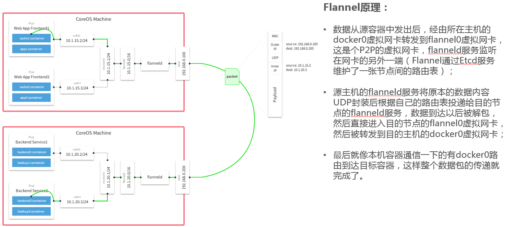

### 1. 容器化的发展

容器革命

当前状态

### 2. kubernetes是什么？
容器编排工具，提供弹性扩容、故障转移、服务发现、负载均衡、存储编排等服务。

### 3. kubernetes组成简介

**实体进程**
* master（kube-apiserver,kube-scheduler,kube-controller-manager,etcd)
* node(kubelet,kube-proxy)

**抽象概念**
* service（ClusterIP、NodePort、LoadBalancer、ExternalName）
* pod

### 4. kubernetes模型
**架构简图**

**流程图**

### 5. 网络模型
**docker**
1. 相同主机上的容器如何互相访问？
* container模式
* bridge模式
2. 不同主机上的容器如何互相访问？
* 搭建overlay网络（flannel）

* 虚拟路由网络（calico）

**k8s**
1. 容器中如何访问service
* clusterIp
* dns

2. 外部如何访问service
* NodePort
* LoadBalancer

### 6. kubernetes存储
* 直接存储
* nas
